# Project 5: Recognition using Deep Networks

**Names:** Joseph Defendre, Sourav Das
**Course:** CS 5330 - Pattern Recognition and Computer Vision
**Date:** March 2026

## Project Overview

This repository presents a deep-learning pipeline for image recognition across four related tasks: a CNN for MNIST digit classification, filter-level network inspection, transfer learning for Greek letters, and Vision Transformer experiments. The project closes with an architecture search study on Fashion-MNIST to compare design tradeoffs and model performance.

## Portfolio Highlights

- The MNIST CNN reached **98.05% test accuracy** after 5 epochs.
- The CNN correctly classified the first **10/10** held-out MNIST examples visualized in the report outputs.
- On handwritten custom digits, the model achieved **70.0% accuracy (7/10)**.
- The transfer-learning model for Greek letters reached its first **perfect training epoch at epoch 14** and scored **83.3% (5/6)** on custom Greek inputs.
- The baseline Vision Transformer reached **98.93% test accuracy**.
- The enhanced transformer extension peaked at **99.0% test accuracy**.
- The Fashion-MNIST architecture search improved accuracy from **82.88%** to **85.15%**.

## Visual Showcase

### Model Architecture

<p align="center">
  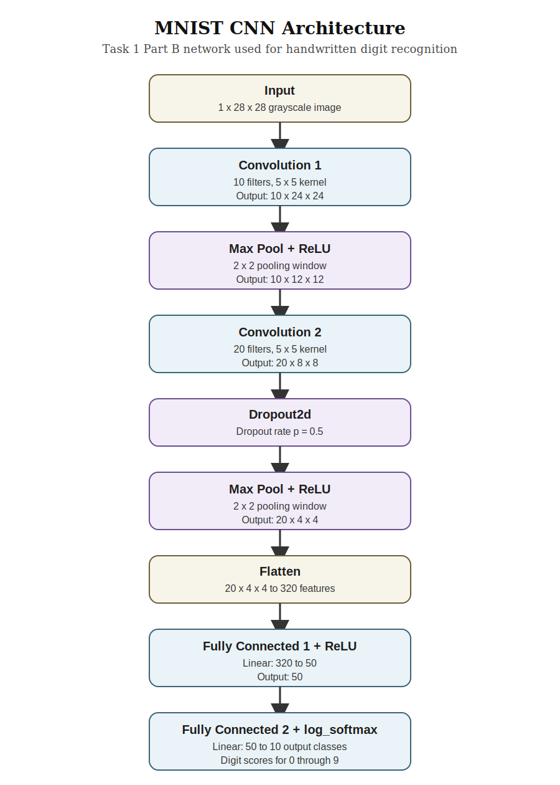
</p>

*High-level architecture view used to document the CNN pipeline and model flow.*

### MNIST CNN Training and Predictions

<p align="center">
  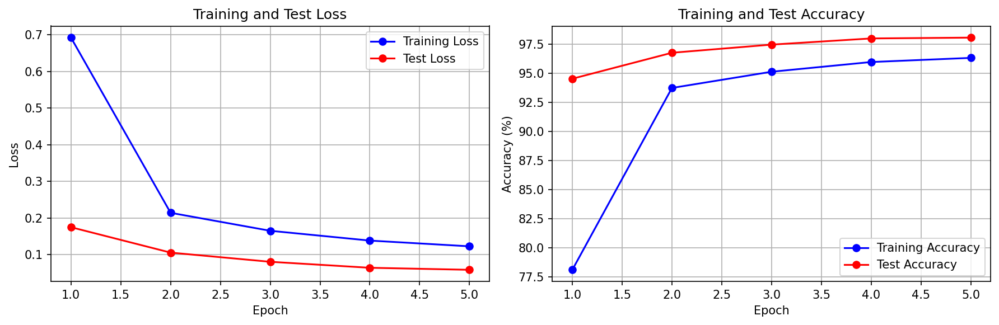
  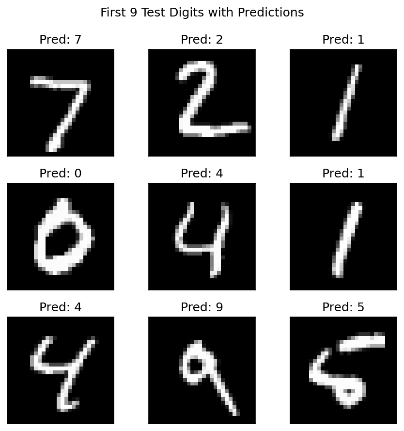
</p>

*Left: training and test accuracy/loss across epochs. Right: sample MNIST predictions from the trained CNN.*

### Custom Digit Inference

<p align="center">
  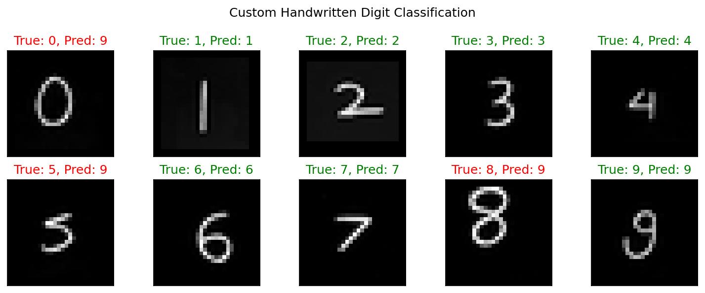
  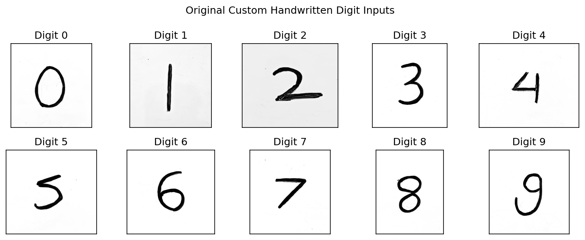
</p>

*The trained MNIST model was evaluated on hand-drawn digit samples to test robustness outside the standard benchmark.*

### First-Layer Filter Analysis

<p align="center">
  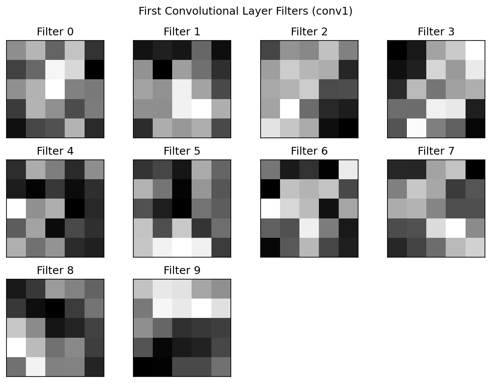
  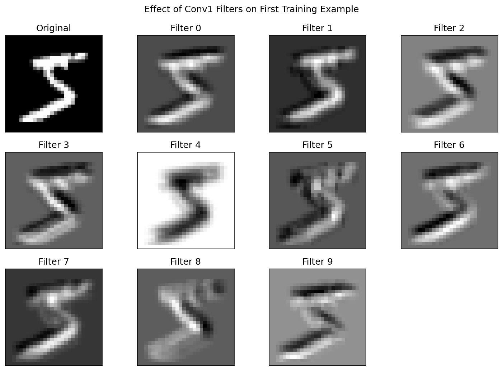
</p>

*These visualizations expose what the first convolutional layer learns and how each filter responds to an input digit.*

### Transfer Learning on Greek Letters

<p align="center">
  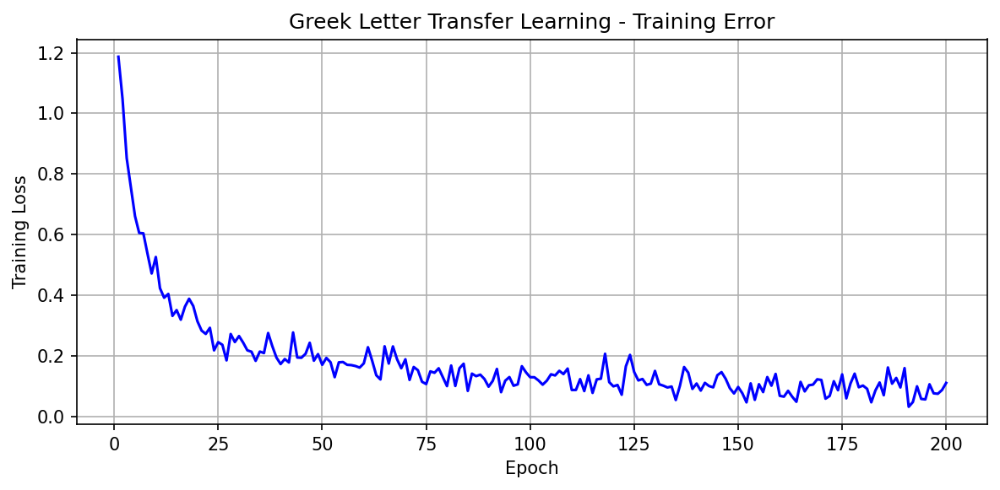
  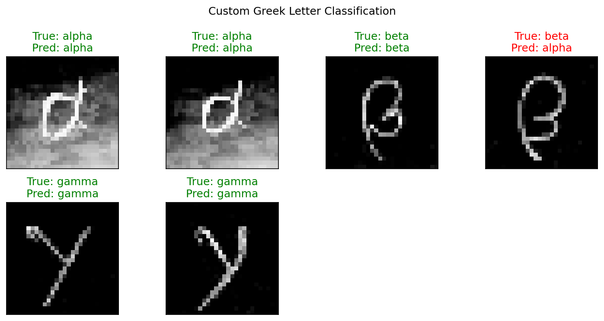
</p>

*A pretrained digit recognizer was adapted to classify alpha, beta, and gamma using a small Greek-letter dataset.*

### Transformer and Architecture Search Results

<p align="center">
  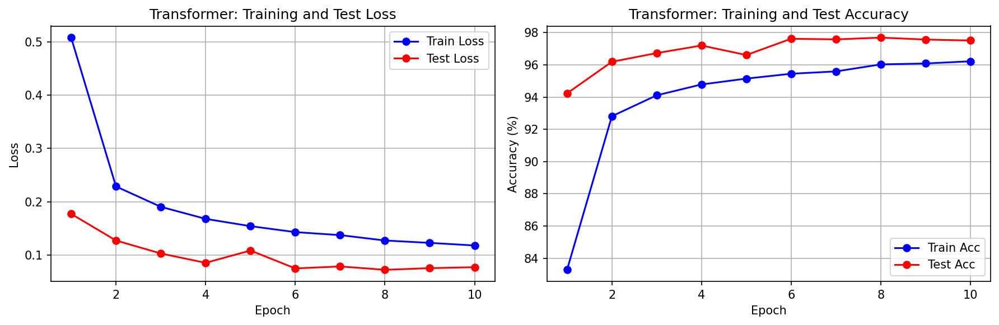
  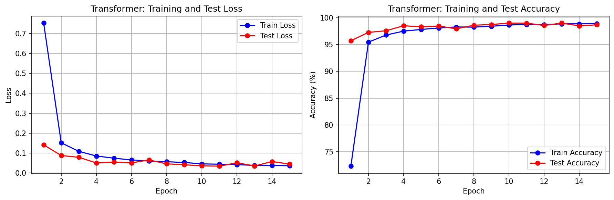
  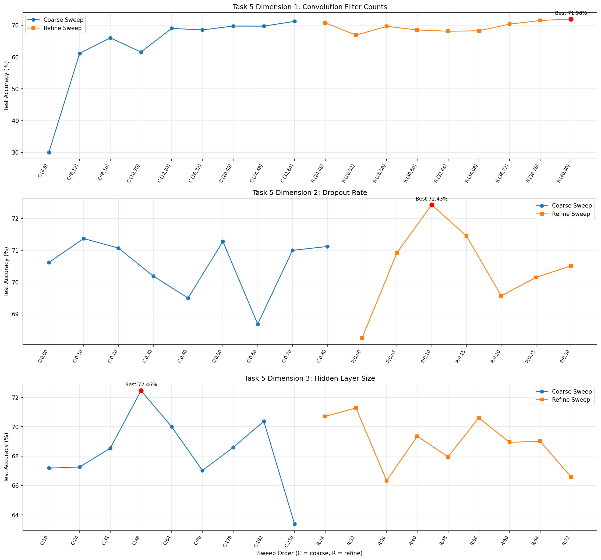
</p>

*These results compare the baseline transformer, the enhanced transformer extension, and the final Fashion-MNIST architecture sweep.*

## Links/URLs
- No videos submitted for this project.
- Custom Greek examples link: https://drive.google.com/drive/folders/1qOwOHZjCKCoBXG1X0rVXl0GSploeAE9X?usp=sharing

## Time Travel Days
- Time travel days used: 0

## Setup

```bash
# Create virtual environment
python3 -m venv venv
source venv/bin/activate

# Install dependencies
pip install -r requirements.txt
```

## Running the Code

### Task 1 Part A: MNIST Test Set Preview
```bash
python3 task1_part_a.py
```
This downloads the MNIST test set if needed and saves a 2x3 subplot of the first six test digits to `results/first_six_digits.png`.

### Task 1 Part B: CNN Network Model
```bash
python3 task1_part_b.py
```
This builds the required MNIST CNN, prints the architecture, verifies the layer output shapes for a 28x28 input, and saves the summary to `results/network_architecture.txt`.

### Task 1 Part C: Train the Model
```bash
python3 task1_part_c.py
```
This trains the MNIST CNN for 5 epochs, evaluates on both the training and test sets after each epoch, saves the plot to `results/training_plot.png`, saves the metrics to `results/training_history.json`, and saves the model to `results/mnist_model.pth`.

### Task 1 Part D: Save the Network to a File
```bash
python3 task1_part_d.py
```
This confirms that the trained network is saved to `results/mnist_model.pth`, creates it by running Task 1 Part C if needed, verifies that the saved weights can be loaded back into the network, and writes file metadata to `results/model_file_info.json`.

### Task 1 Part E: Read the Network and Run It on the Test Set
```bash
python3 task1_part_e.py
```
This loads the saved MNIST model in evaluation mode, runs it on the first 10 test examples, prints the 10 output values plus predicted and true labels, saves the text table to `results/test_set_outputs.txt`, and saves the first 9 predictions plot to `results/first_nine_predictions.png`.

### Task 1 Part F: Test the Network on New Inputs
```bash
python3 task1_part_f.py
```
This loads the saved MNIST model, runs it on handwritten digit images placed in `custom_digits/`, saves the classification figure to `results/custom_digits_results.png`, and saves the printed results to `results/custom_digit_outputs.txt`.

### Task 1: Train MNIST Network
```bash
python3 train_mnist.py
```
This trains the CNN on MNIST digits for 5 epochs and saves the model to `results/mnist_model.pth`.

### Task 1 (continued): Test on MNIST and Custom Digits
```bash
python3 test_mnist.py
```
Place your handwritten digit images in `custom_digits/` using filenames `0` through `9` with a common image extension such as `PNG`, `JPG`, `JPEG`, or `BMP` before running.

### Task 2: Examine the Network
```bash
python3 examine_network.py
```
Analyzes conv1 filters and shows their effects on a sample digit.

### Task 2 Part A: Analyze the First Layer
```bash
python3 task2_part_a.py
```
This loads the trained MNIST model, prints the model structure, saves the first-layer weight tensor dump to `results/conv1_weights.txt`, and saves the 10-filter visualization to `results/conv1_filters.png`.

### Task 2 Part B: Show the Effect of the Filters
```bash
python3 task2_part_b.py
```
This loads the trained MNIST model, applies the 10 `conv1` filters to the first MNIST training example using OpenCV `filter2D`, and saves the visualization to `results/filter_effects.png`.

### Task 3: Transfer Learning on Greek Letters
```bash
python3 transfer_learning.py
```
Download and extract the Greek letters dataset into `greek_train/` at the project root, or into `data/greek_train/`, with subdirectories `alpha/`, `beta/`, and `gamma/` before running.
The script saves the modified network summary to `results/greek_model_architecture.txt`, the training plot to `results/greek_training_loss.png`, the metric history to `results/greek_training_history.json`, and the trained model to `results/greek_model.pth`.
Place custom Greek letter images in `custom_greek/` to evaluate your own alpha, beta, and gamma symbols.

### Task 4: Transformer Network
```bash
python3 net_transformer.py
```
Trains the template-based Vision Transformer on MNIST using the default Task 4 settings.
The script saves the architecture summary to `results/transformer_architecture.txt`, the training plot to `results/transformer_training.png`, the metric history to `results/transformer_history.json`, and the trained weights to `results/transformer_model.pth`.

### Extension: Enhanced Transformer Patch Embedding + Classifier
```bash
python3 net_transformer.py --variant extension
```
Runs the transformer extension with a convolutional patch-embedding stem, a learned CLS token, and a deeper classifier head.
The script saves the architecture summary to `results/transformer_extension_architecture.txt`, the training plot to `results/transformer_extension_training.png`, the metric history to `results/transformer_extension_history.json`, and the trained weights to `results/transformer_extension_model.pth`.

### Task 5: Experiment
```bash
python3 experiment.py
```
Runs the Task 5 Fashion-MNIST architecture search across 3 CNN dimensions using a two-pass linear search.
The script saves the raw metrics to `results/experiment_results.json`, the sweep plot to `results/experiment_results.png`, and a compact summary to `results/experiment_summary.txt`.

## File Structure
- `task1_part_a.py` — Task 1.A: Load MNIST test data and plot the first six digits
- `task1_part_b.py` — Task 1.B: Build and summarize the CNN network model
- `task1_part_c.py` — Task 1.C: Train the CNN and save metrics/model outputs
- `task1_part_d.py` — Task 1.D: Verify that the trained CNN is saved and reloadable
- `task1_part_e.py` — Task 1.E: Evaluate the saved CNN on the first 10 MNIST test examples
- `task1_part_f.py` — Task 1.F: Evaluate the saved CNN on custom handwritten digit images
- `task2_part_a.py` — Task 2.A: Print and visualize the first convolutional-layer weights
- `task2_part_b.py` — Task 2.B: Apply the first-layer filters to the first training example
- `train_mnist.py` — Task 1: Build and train CNN
- `test_mnist.py` — Task 1.5-1.6: Test on MNIST + custom digits
- `examine_network.py` — Task 2: Analyze network filters
- `transfer_learning.py` — Task 3: Greek letter transfer learning
- `net_transformer.py` — Task 4: Transformer-based classifier
- `experiment.py` — Task 5: Architecture experimentation
- `results/` — Output plots and saved models
- `report.html` — Project report (PDF generated from HTML)
